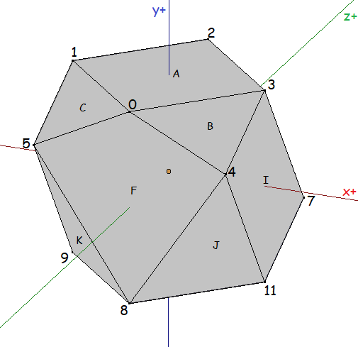
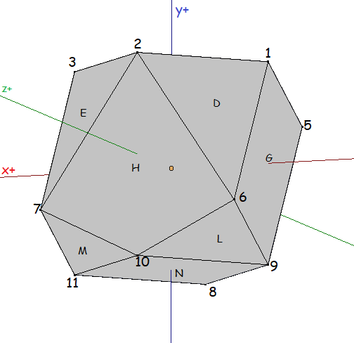
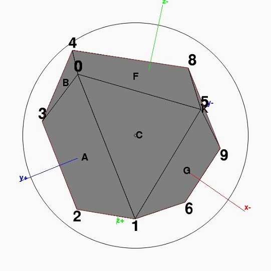
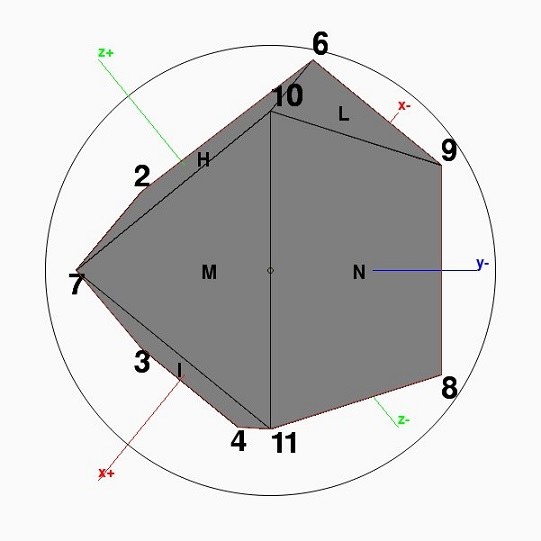
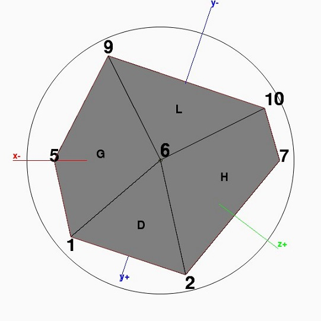

# View Model Generator
> A simple program used to generate specific views from a given view points at a specified (simple) object I had to analyze as one of my projects.

## Screenshots

## Technologies
* Python 3.7.3

## TODO
* Current naive implementation has troubles with the depth, therefore axis' lines may be rendered incorrectly relative to the object
* Switching to PyOpenGL
* Non-naive version of the algorithm for a one-view fields for each specified view point. 
